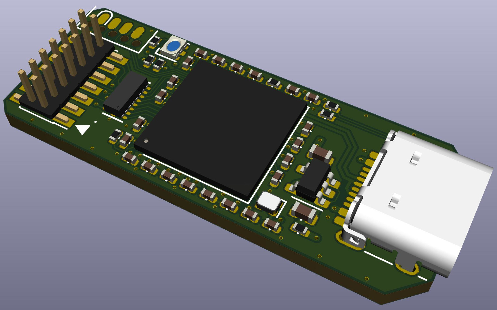

# High-speed Probe

This is an open hardware probe for the Serial Wire Debug (SWD) and JTAG protocol. It utilizes an
STM32F723 MCU which has an USB 2.0 High-speed Phy.

* The output connector can either be the STDC14 connector used on STLink/V3 or the standard Cortex-M
Debug (1.27mm, 10 pin) connector.
* The programming connector is the SOICBite.

WIP.

