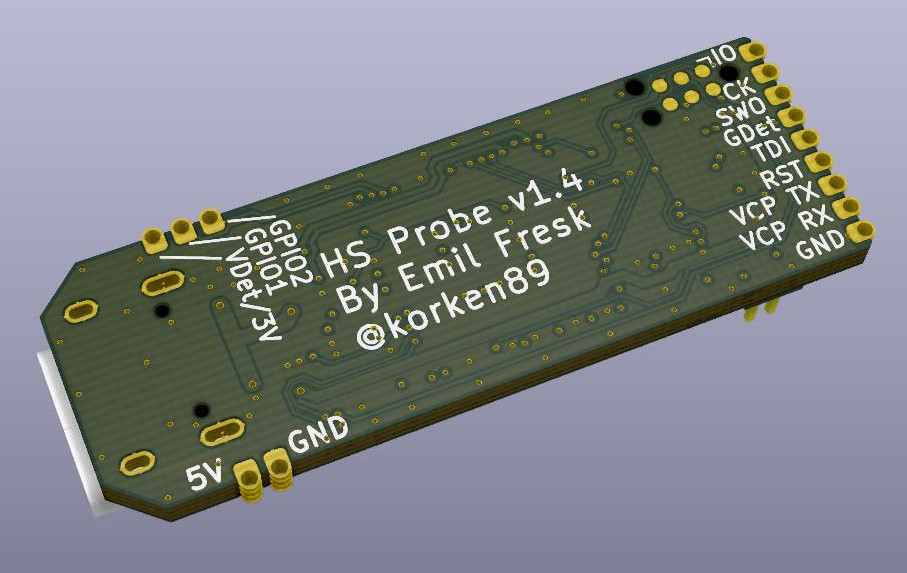

# High-speed Probe

This is an open hardware probe for the Serial Wire Debug (SWD) and JTAG protocol. It utilizes an
STM32F723 MCU which has an USB 2.0 High-speed Phy.

There is an USB MUX on the board, so when the probe starts it enumerates in USB FS where one can access the internal bootloader, and then when the firmware takes over it can switch to the USB HS.

* The output connector can either be the STDC14 connector used on STLink/V3 or the standard Cortex-M.
Debug (1.27mm, 10 pin) connector.
* The programming connector is the SOICBite.
* USB MUX between USB HS/FS.
* Castellated vias for all programming pins.

WIP.

